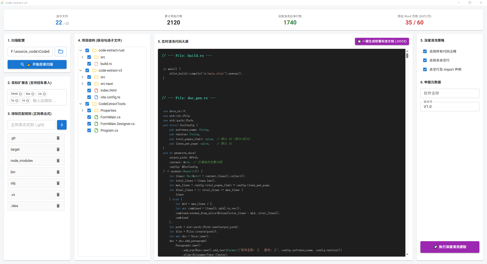

# 软著代码提取助手 Pro | Software Copyright Code Extractor Pro

[](https://www.rust-lang.org/)
[](https://react.dev/)
[](https://tauri.app/)
[](https://github.com/)

[中文](#中文说明) | [English](#english-description)

---

## 中文说明

### 🌟 简介
**CodeExtractTools** 是一个专门用于为中国软件著作权申请提取、清洗源代码的极速原生工具集。
经历过多次极客重构，目前向大众推荐最强大、最完美的 **V3.0** 版本：

- **v3.0 (Ultimate/Active)**: 基于 `Rust (Tauri)` + `React 18` + `Material UI` 构建的终极版本（位于 `code-extract-v3/` 目录下）。
- **v2.0 (Legacy)**: 基于 `Rust` 和 `Slint` 构建的原生轻量级版本（位于 `code-extract-rust/` 目录下）。
- **v1.0 (Legacy)**: 基于 `C# .NET WinForm` 构建的最早期初始体验版（位于 `CodeExtractTools/` 目录下）。



### 🚀 核心痛点解决 (v3.0 Ultimate)

在申请软著时，整理那几十上百页的无缩进、无多余空行、无大量注释的源代码是一项极其枯燥且容易出错的体力活。本工具将这个过程缩短至 **3 秒钟**。

- **三效合一的智能净化器**：一键剔除 `.git`、`node_modules` 等无关目录。深度清洗策略，精准扒掉多余空行、所有的代码注释（`//`, `/* */`, `#`, `--` 等）、无效引入等冗余信息。
- **动态扩展名嗅探**：依托 Rust 并发文件流瞬间遍历项目。抛开写死的后缀，智能嗅探目录下所有的真实代码文件后缀并在界面呈现。
- **彩色代码清洗大屏**：采用原生 MUI 四栏布局与 Syntax Highlighter 真彩高亮引擎，清洗效果所见即所得。
- **一键原生 Word (.docx) 生成**：无需繁文缛节，点击按钮即可驱动底层 XML 引擎，秒级输出完美的软著格式 Word 文件——自动按满页 50 行无缝排版、自动超过 3000 行实施前后三十页（前1500 + 后1500）斩断策略、完美附带带软件版本号的页眉及自动生成的全局页脚。

### 📊 版本对比 (Comparison)
| 特性 | v1.0 (C# WinForm) | v2.0 (Rust Slint) | v3.0 (Tauri React) |
| :--- | :--- | :--- | :--- |
| **架构** | 传统框架 | 底层 UI 框架 | **前端 Web UI + Rust Core** |
| **导出控制** | 手动拷贝居多 | 自然排版 Word | **终极 50 行严格强控 + 阈值斩断 Docx** |
| **状态显示** | 同步执行易假死 | 全异步流畅 | **真彩大屏，清洗流式高亮预览** |
| **文件过滤** | 手动正则表达式 | 智能白名单正则 | **智能白名单正则 + 全局级自动后缀嗅探** |
| **平台兼容** | Windows | Win / Lin / Mac | **Windows / Linux / macOS** |

---

## 🛠️ 安装与运行 | Installation & Usage (v3.0)

### 运行开发版 (Dev Run)
```bash
# 需准备 Node.js 与 Rust 基础环境
git clone <repo-url>
cd code-extract-v3
npm install
npm run tauri dev
```

### 编译分发打包 (Release Build)
```bash
cd code-extract-v3
npm run tauri build
```
执行完毕后，您可在 `src-tauri/target/release` 中取得极度轻巧（仅几 MB 级别）、双击即用、零环境依赖的独立 `.exe` 可安装/免安装文件。

---

## English Description

### 🌟 Introduction
**Software Copyright Code Extractor Pro (v3.0)** is an ultimate, high-performance desktop utility built with Rust (Tauri) and React. Designed to extract and clean source code for Chinese Software Copyright applications. Migrating from v2.0 (Rust Slint) and v1.0 (C# .NET), this v3.0 update offers a beautiful Material UI layout, precise word wrap logic, and native `.docx` document compilation capabilities.

### 🚀 Key Features (v3.0 Ultimate)
- **Rust-Powered Engine & React WebUI**: Blazing-fast file fetching logic handled by Rust, while React provides an incredibly reactive and gorgeous 4-column UI layout.
- **Smart Extension Sniffing**: Automatically scan through hundreds of thousands of files to figure out active source code language extensions interactively.
- **Deep Code-Cleaning Engine**: Accurately wipe out empty lines, comments (`//`, `#`, `/* */`), and useless import declarations dynamically with live syntax highlighted previews.
- **Ultimate Docx Exporter**: Instead of messing around with MS Word line spacings by hand, click "Export" and our bare-metal `docx-rs` generator will spit out a perfect `.docx` standard format document—enforce exactly 50 lines per A4 page and automatically cuts large source codes exceeding 3000 lines (30 start + 30 end pages format) with designated headers and numbered footers.

## 📄 开源协议 | License
MIT License
